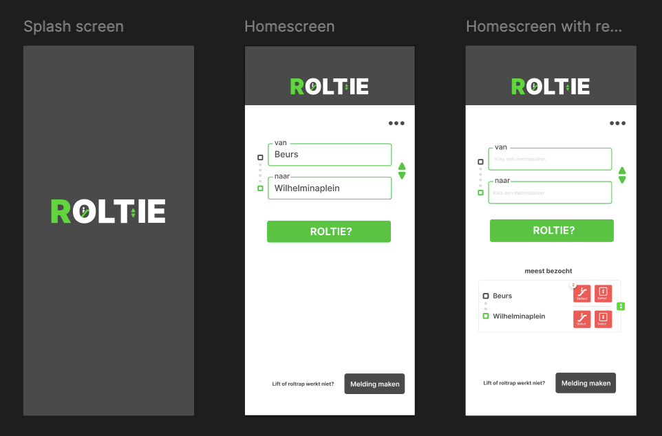
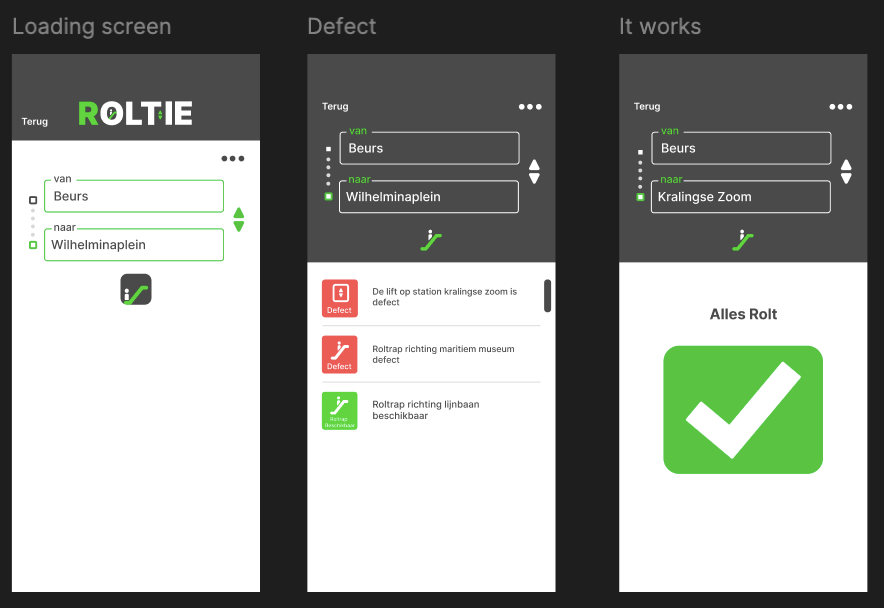
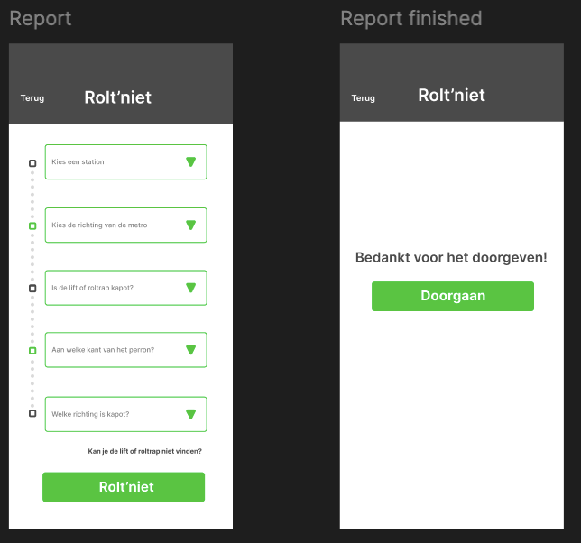
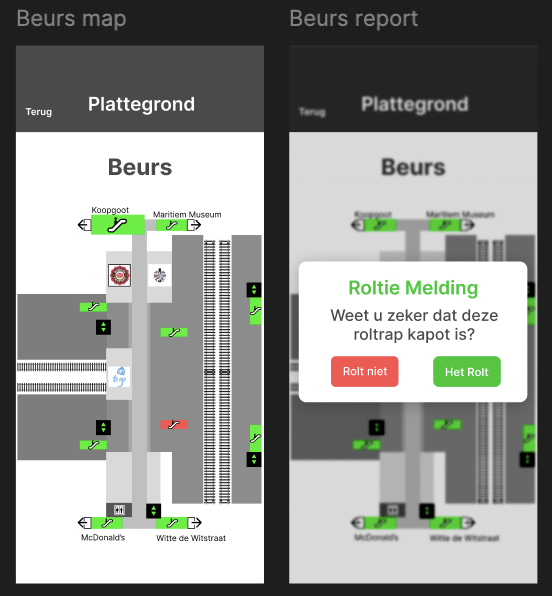
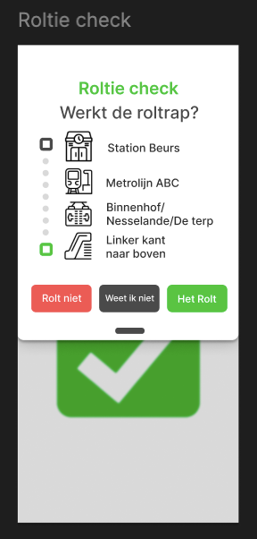
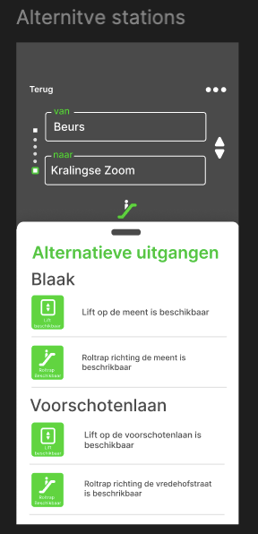

# Portfolio Projects – Jens Verhoeff

This repository provides a visual and practical overview of the meaningful projects I have worked on — and continue to develop — since the beginning of my studies in Creative Media and Game Technology. It reflects both my technical growth and my passion for building thoughtful, user-centered digital experiences.

---

## Project 1: Handen Vol Trots/Viseble Voices

**Description:**  
An innovative art installation that empowers deaf children to create visual art using sign language. Through the use of AI and TouchDesigner, the system translates hand gestures into interactive visuals, enabling a playful, accessible, and inclusive artistic experience.

**Impact:**

- Highlights the beauty and power of sign language

- Encourages pride and self-expression in deaf children

- Bridges communication and creativity between deaf and hearing audiences

**Technology:**  
TouchDesigner · Python · Custom Sign Language Recognition Mode

**Demo / Visuals:**  

### Blijdschap/euforie

  

### Woede/haat

  

### Verdriet/eenzaam

  

---

## Project 2: Roltie

**Description:**  
A mobile application designed to help people with motor disabilities navigate public transportation more reliably. The app includes a route planner that factors in real-time elevator and escalator outages at stations such as Beurs. When planning a route, it clearly indicates which elevators or escalators are currently out of service. The data is crowdsourced — users can report outages themselves, similar to how Flitsmeister collects real-time traffic updates — making the system more responsive and community-driven.

**Problem Statement:**  
For most travelers, encountering broken escalators and elevators is a minor inconvenience. But for those who rely on them, it can mean facing unexpected obstacles with no immediate support or alternative route available.

**Design Question:**  
How can we ensure that students with motor disabilities are informed about broken elevators and escalators, and receive the best possible route based on that information?

**Technologies:**  
React Native · Expo Go · mongoDB

**Designs:**

### Start Screen  

### Roltie?  

### Report

### Map

### Validation

### Alternitive Stations

---

## Contact  
Want to know more or collaborate? Feel free to reach out:  
jens.verhoeff@gmail.com  
(+31) 6 30 88 29 81
